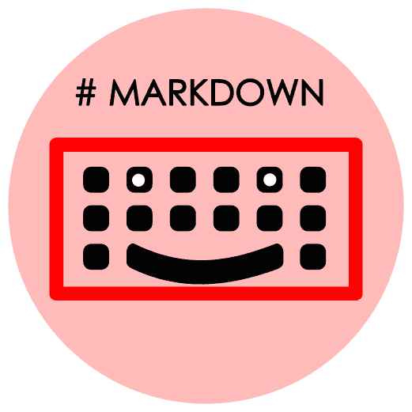
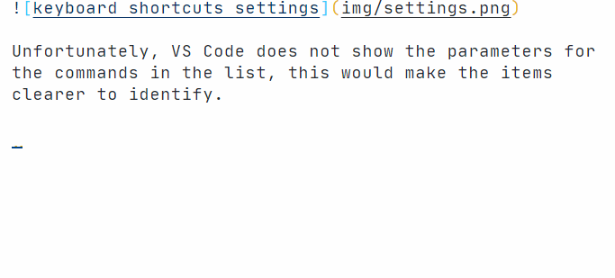

<h1 align="center">
   
    
   
	 
  Marky Shortcuts
   
   
</h1>
<h4 align="center">Keyboard shortcuts for markdown snippets</h4>

> This extension is best used as a source of inspiration for creating your own shortcuts for markdown snippets. It *should* work forever. The project is now closed to contributions - the repo is archived.

The cool thing about snippets is that they can be setup to behave like a wizard and give a guided editing experience. 🧙‍♂️ Adding keyboard shortcuts to snippets can improve your typing efficiency when writing markdown documents. ⌨️✨

In the example above, a task list is inserted. You can tab through each task to complete them. If you don't want to edit the snippet at all, or you are done early, just hit `Enter` and the snippet will be finalised. Easy-peasy! 🙌

The snippets are sourced from:
- [VS Code](https://github.com/microsoft/vscode/blob/f74e473238aca7b79c08be761d99a0232838ca4c/extensions/markdown-basics/snippets/markdown.code-snippets):  The built-in snippets for the basic markdown syntax.
- [Markdown Snippets extension](https://marketplace.visualstudio.com/items?itemName=robole.markdown-snippets): Snippets for extended markdown syntax.

The *Markdown Snippets* extension is installed automatically along with this extension. Nothing extra is required by you! 🙂

## Shortcuts

| Name                     | Shortcut                       | Prefix           | Defined By                  |
|--------------------------|--------------------------------|------------------|-----------------------------|
| Insert bold text         | Ctrl+b        Cmd+b (mac) | bold             | VS Code          |
| Insert code              | Ctrl+m Ctrl+c                  | code             | VS Code          |
| Insert fenced code block | Ctrl+m Ctrl+f                  | fenced codeblock | VS Code          |
| Insert heading level 1   | Ctrl+m Ctrl+1                  | heading1         | VS Code |
| Insert heading level 2   | Ctrl+m Ctrl+2                  | heading2         | VS Code |
| Insert heading level 3   | Ctrl+m Ctrl+3                  | heading3         | VS Code |
| Insert heading level 4   | Ctrl+m Ctrl+4                  | heading4         | VS Code |
| Insert heading level 5   | Ctrl+m Ctrl+5                  | heading5         | VS Code |
| Insert heading level 6   | Ctrl+m Ctrl+6                  | heading6         | VS Code |
| Insert horizontal rule   | Ctrl+m Ctrl+h                  | horizontal rule  | VS Code          |
| Insert image             | Ctrl+m Ctrl+i                  | image            | VS Code          |
| Insert italic text       | Ctrl+i        Cmd+i (mac)  | italic           | VS Code          |
| Insert link              | Ctrl+m Ctrl+l                  | link             | VS Code          |
| Insert ordered list      | Ctrl+m Ctrl+o                  | ordered list     | VS Code          |
| Insert unordered list    | Ctrl+m Ctrl+u                  | unordered list   | VS Code          |
| Insert quoted text       | Ctrl+m Ctrl+q                  | quote            | VS Code          |
| Insert strikethrough     | Ctrl+m Ctrl+s                  | strikethrough    | VS Code |
| Insert table             | Ctrl+m Ctrl+t                  | table            | Markdown Snippet Extension |
| Insert task list         | Ctrl+m Ctrl+x                  | task list        | Markdown Snippet Extension |

None of these shortcuts are used by default in VS Code with the exception of `Ctrl+b`. This shortcut is used to "View: Toggle Side Bar Visibility". If you are not editing a markdown file, it will still do this. This may not be to your liking, you are free to assign a different shortcut for it, or others if you wish!

### Rationale

I chose these particular shortcuts because:
1. The '`Ctrl` plus one key' combinations are mostly used already.
1. The '`Ctrl+Shift` plus one additional key' combinations are mostly used already.
1. I wanted to find a consistent and predictable pattern, so opted for combinations that have the same opening sequence.
1. I made an exception for "insert bold" and "insert italic" as most text editors have `ctrl+b` and `ctrl+i` as the shortcuts for these actions, so I thought it best to do the same.

### How to change the shortcuts

You can read my article, [VS Code keyboard shortcuts that will boost your productivity](https://www.roboleary.net/2022/02/28/vscode-keyboard-fu-custom-keyboard-shortcuts.html) to learn more about keyboard shortcuts.

## Appreciate

You can [buy me a coffee](https://ko-fi.com/roboleary) if you would like to support me to make more great open-source software.

## Icon Attribution

- Based on "Heart" by Raji Purcell from the Noun Project
