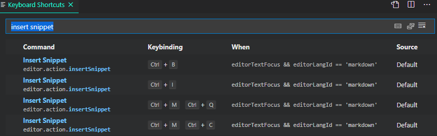

# Markdown Shortcuts

Keyboard shortcuts for markdown snippets.

The cool thing about snippets is that they can be setup to behave like a wizard and give a guided editing experience. 🧙‍♂️

In the example above, when you insert a task list, you can tab through each task completing them as you go. For each task, first you are given options to check/uncheck (x or blank) that task, then you can enter the title. If you don't want to edit the snippet at all, or you are done early, just hit `Enter` and the snippet will be finalised. Easy-peasy! 🙌

The snippets are sourced from:
- [VS Code](https://github.com/microsoft/vscode/blob/f74e473238aca7b79c08be761d99a0232838ca4c/extensions/markdown-basics/snippets/markdown.code-snippets):  Built-in snippets for the basic markdown syntax.
- [Markdown Snippets extension](https://marketplace.visualstudio.com/items?itemName=robole.markdown-snippets): Snippets for extended markdown syntax.

The *Markdown Snippets* extension is installed automatically along with this extension. Nothing extra is required by you! 🙂

## Shortcuts

| Name                     | Shortcut                       | Prefix           | Defined By                  |
|--------------------------|--------------------------------|------------------|-----------------------------|
| Insert bold text         | Ctrl+b        Cmd+b (mac) | bold             | VS Code          |
| Insert code              | Ctrl+m Ctrl+c                  | code             | VS Code          |
| Insert fenced code block | Ctrl+m Ctrl+f                  | fenced codeblock | VS Code          |
| Insert heading level 1   | Ctrl+m Ctrl+1                  | heading1         | VS Code |
| Insert heading level 2   | Ctrl+m Ctrl+2                  | heading2         | VS Code |
| Insert heading level 3   | Ctrl+m Ctrl+3                  | heading3         | VS Code |
| Insert heading level 4   | Ctrl+m Ctrl+4                  | heading4         | VS Code |
| Insert heading level 5   | Ctrl+m Ctrl+5                  | heading5         | VS Code |
| Insert heading level 6   | Ctrl+m Ctrl+6                  | heading6         | VS Code |
| Insert horizontal rule   | Ctrl+m Ctrl+h                  | horizontal rule  | VS Code          |
| Insert image             | Ctrl+m Ctrl+i                  | image            | VS Code          |
| Insert italic text       | Ctrl+i        Cmd+i (mac)  | italic           | VS Code          |
| Insert link              | Ctrl+m Ctrl+l                  | link             | VS Code          |
| Insert ordered list      | Ctrl+m Ctrl+o                  | ordered list     | VS Code          |
| Insert unordered list    | Ctrl+m Ctrl+u                  | unordered list   | VS Code          |
| Insert quoted text       | Ctrl+m Ctrl+q                  | quote            | VS Code          |
| Insert strikethrough     | Ctrl+m Ctrl+s                  | strikethrough    | VS Code |
| Insert table             | Ctrl+m Ctrl+t                  | table            | Markdown Snippet Extension |
| Insert task list         | Ctrl+m Ctrl+x                  | task list        | Markdown Snippet Extension |

None of these shortcuts are used by default in VS Code with the exception of `Ctrl+b`. This shortcut is used to "show the sidebar", if you are not editing a markdown file, it will still do this. This may not be to your liking, you are free to assign a different shortcut for it, or others if you wish!

### Rationale

I chose these particular shortcuts because:
1. The '`Ctrl` plus one key' combinations are mostly used already.
1. The '`Ctrl+Shift` plus one additional key' combinations are mostly used already.
1. I wanted to find a consistent and predictable pattern, so opted for combinations that have the same opening sequence.
1. I made an exception for "insert bold" and "insert italic" as most text editors have `ctrl+b` and `ctrl+i` as the shortcuts for these actions, so I thought it best to do the same.

### How to change the shortcuts

You can change the keyboard shortcuts to whatever you want in the *Keyboard Shortcuts UI*.

Unfortunately, VS Code does not show the `args` of a command that would enable you to identify the particular markdown snippet. So, we can't just search for "insert table".

To get the list of markdown shortcuts, search for "insert snippet". It is all the items where the `Command` is "Insert Snippet, and the `When` clause has the condition of `!editorReadonly && editorTextFocus && editorLangId == markdown`. You need to know the current keybinding to find the snippet shortcut you are interested in.

There is an [open issue](https://github.com/microsoft/vscode/issues/84072) to improve the *Keyboard shortcuts  UI* to make this a better experience. Hopefully, this will happen soon, you can give the issue a 👍 to indicate your interest in the implementation of a solution.

## Contribute

If you have a suggestion or find a bug, please file an issue.

## Show gratitude

If you are happy with the extension, please star the repo, and leave a review to help others find it. 🌟

You can [buy me a coffee](https://www.buymeacoffee.com/robole) if you would like to support me to make more great open-source software. ☕🙏

## Icon Attribution

- Based on "Heart" by Raji Purcell from the Noun Project
